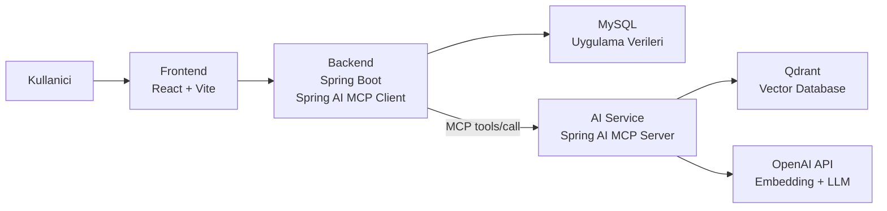
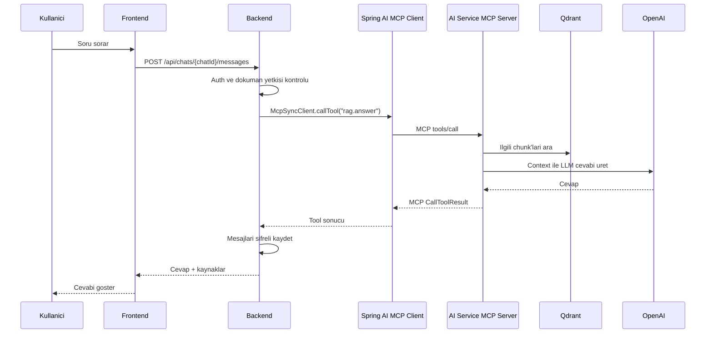

# MCP Tabanli LLM Destekli Web Uygulamasi - Sunum Dokumani

## 1. Projenin Kisa Tanimi

Bu proje, kullanicilarin PDF dokumanlari yukleyip bu dokumanlar uzerinden yapay zeka destekli soru-cevap yapabilmesini saglayan bir web uygulamasidir.

Uygulama klasik bir chatbot degildir. Kullaniciya genel internet bilgisine dayali cevap vermek yerine, kullanicinin yukledigi PDF dokumanini isler, dokumandan ilgili parcalari bulur ve cevabi bu parcalara dayanarak uretir.

Bu yaklasim RAG, yani Retrieval Augmented Generation mimarisi olarak adlandirilir.

Projenin en onemli teknik noktalarindan biri, backend ile AI service arasindaki iletisimin Model Context Protocol yani MCP ile yapilmasidir. Bu sayede backend, AI service'e rastgele endpointler uzerinden degil, standart MCP tool cagrilari uzerinden gorev verir.

## 2. Projenin Amaci

Projenin temel amaci, PDF dokumanlari uzerinden guvenilir, kaynakli ve baglama dayali cevaplar ureten bir sistem gelistirmektir.

Bu hedef icin sistem su sorulara cozum uretir:

- Kullanici bir PDF yuklediginde bu PDF nasil islenecek?
- PDF icerigi nasil anlamli parcalara ayrilacak?
- Kullanici soru sordugunda PDF'in ilgili kismi nasil bulunacak?
- LLM'in dokuman disina cikmadan cevap vermesi nasil saglanacak?
- Backend ile AI service arasindaki yapay zeka islemleri nasil standart ve kontrol edilebilir hale getirilecek?

Bu sorularin cevabi projede uc temel kavramla verilir:

- RAG
- Vector database
- MCP

## 3. Problem Tanimi

Buyuk dil modelleri genel bilgi uretmede gucludur, fakat belirli bir PDF dosyasindaki bilgileri dogru sekilde kullanabilmeleri icin dosyanin icerigine ihtiyac duyarlar.

Bir PDF dokumani dogrudan modele verildiginde bazi sorunlar ortaya cikabilir:

- PDF cok uzun olabilir.
- Model tum dokumani ayni anda isleyemeyebilir.
- Model dokuman disindan tahmin yurutebilir.
- Cevabin hangi sayfaya veya hangi parcaya dayandigi belirsiz olabilir.
- Her soru icin tum PDF'i modele vermek maliyetli ve verimsiz olur.

Bu nedenle proje, PDF'i once islenebilir parcalara ayirir. Her parca embedding vektorune cevrilir ve Qdrant vector database icinde saklanir. Kullanici soru sordugunda, soru da embedding'e cevrilir ve Qdrant uzerinden en ilgili dokuman parcalari bulunur.

Sonrasinda LLM'e sadece bu ilgili parcalar context olarak verilir. Boylece cevap, dokuman baglamina dayali uretilir.

## 4. Kullanilan Teknolojiler

### Frontend

- React
- TypeScript
- Vite
- Axios
- Tailwind CSS

Frontend kullanici arayuzunu saglar. Login, register, PDF yukleme, dokuman listeleme, chat acma ve mesaj gonderme gibi islemler frontend uzerinden yapilir.

### Backend

- Java 17
- Spring Boot
- Spring Security
- JWT authentication
- Spring AI MCP Client
- JPA / Hibernate
- Flyway
- MySQL

Backend uygulamanin ana kontrol katmanidir. Kullanici dogrulama, dokuman yetkilendirme, chat yonetimi, mesaj kayitlari ve AI service ile MCP uzerinden iletisim backend tarafinda yapilir.

### AI Service

- Java 17
- Spring Boot
- Spring AI MCP Server
- OpenAI API
- RAG pipeline
- Qdrant entegrasyonu

AI service, dokuman zekasi katmanidir. Embedding uretir, Qdrant'a vektor kaydeder, retrieval yapar ve RAG cevabi olusturur.

### Veritabani ve Vector Database

- MySQL
- Qdrant

MySQL uygulama verilerini saklar. Qdrant ise dokuman chunk embeddinglerini saklayan vector database olarak kullanilir.

### DevOps

- Docker
- Docker Compose

Docker Compose ile frontend, backend, AI service, MySQL ve Qdrant tek komutla calistirilir.

## 5. Genel Mimari

Proje cok katmanli bir mimariye sahiptir.



Bu mimaride her katmanin sorumlulugu ayridir:

- Frontend kullanici arayuzudur.
- Backend authentication, authorization ve orkestrasyon katmanidir.
- AI service RAG ve LLM islemlerinden sorumludur.
- MySQL kalici uygulama verilerini tutar.
- Qdrant embedding vektorlerini ve semantic search verilerini tutar.

## 6. Is Akisi

### 6.1 Kullanici Girisi

1. Kullanici frontend uzerinden login olur.
2. Frontend backend'e email ve sifre gonderir.
3. Backend kullanici sifresini BCrypt ile dogrular.
4. Backend access token ve refresh token uretir.
5. Frontend tokenlari saklar.
6. Sonraki API isteklerinde access token kullanilir.

### 6.2 PDF Yukleme

1. Kullanici frontend uzerinden PDF yukler.
2. Backend kullanicinin yetkisini kontrol eder.
3. Backend PDF dosyasini storage alanina kaydeder.
4. PDF metni sayfa sayfa cikarilir.
5. Metin chunk'lara ayrilir.
6. Her chunk icin AI service uzerinden embedding uretilir.
7. Chunk metadata bilgisi MySQL'e kaydedilir.
8. Chunk embeddingleri Qdrant'a indexlenir.

### 6.3 Dokuman Uzerinden Soru-Cevap

1. Kullanici bir dokuman uzerinden chat acip soru sorar.
2. Backend kullanicinin bu chat ve dokumana erisim yetkisini kontrol eder.
3. Backend kullanici mesajini kaydetmeden once isler.
4. Backend, AI service'e MCP uzerinden `rag.answer` tool cagrisi yapar.
5. AI service soruyu embedding'e cevirir.
6. Qdrant'ta ilgili chunk'lar aranir.
7. Ilgili chunk'lar LLM prompt'una context olarak eklenir.
8. LLM sadece bu context'e dayanarak cevap uretir.
9. AI service cevabi ve kaynak bilgilerini backend'e dondurur.
10. Backend mesajlari sifreli sekilde DB'ye kaydeder.
11. Frontend cevabi kullaniciya gosterir.

## 7. MCP Nedir?

MCP, Model Context Protocol ifadesinin kisaltmasidir.

MCP, yapay zeka uygulamalarinda model veya AI service ile dis sistemler arasindaki iletisimi standartlastirmak icin kullanilan bir protokoldur.

Basit anlatimla MCP sunu saglar:

- Bir servis hangi islemleri yapabiliyor, bunlari tool olarak tanimlar.
- Diger servis bu tool'lari standart bir protokol ile listeler.
- Diger servis ihtiyac duydugunda bu tool'lardan birini standart formatta cagirir.
- Tool sonucu yine standart MCP response formatinda geri doner.

Bu proje icin MCP'nin anlami sudur:

Backend, AI service'e "su endpoint'e su JSON'u gonder" seklinde rastgele bir API cagrisi yapmaz. Bunun yerine AI service'in sundugu MCP tool'larini kullanir.

Yani backend, AI service'e su sekilde gorev verir:

- `document.embed` tool'unu calistir.
- `document.index` tool'unu calistir.
- `retrieval.search` tool'unu calistir.
- `rag.answer` tool'unu calistir.

Bu, backend ile AI service arasinda daha standart, okunabilir ve genisletilebilir bir iletisim modeli olusturur.

## 8. Bu Projede MCP Tam Olarak Nerede Kullaniliyor?

Bu projede MCP, frontend ile kullanici arasindaki sohbet icin kullanilmaz.

MCP'nin kullanildigi yer:

```text
Backend <-> AI Service
```

Frontend kullanici arayuzudur. Kullanici frontend'de soru sorar, frontend bu soruyu backend'e normal HTTP API ile gonderir.

Backend ise AI service ile konusurken resmi MCP client kullanir. AI service de resmi MCP server olarak calisir.

Guncel mimari:

```text
Frontend
   |
   | Normal REST API
   v
Backend
   |
   | Spring AI MCP Client
   | MCP tools/call
   v
AI Service
   |
   | Spring AI MCP Server
   v
MCP Tool'lari
```

Bu nedenle proje MCP'yi dogrudan kullanir:

- Backend tarafinda Spring AI MCP Client vardir.
- AI service tarafinda Spring AI MCP Server vardir.
- AI service `/mcp` endpoint'i sunar.
- Backend `McpSyncClient` ile MCP tool cagrisi yapar.

## 9. MCP Client ve MCP Server Yapisi

### Backend: Spring AI MCP Client

Backend tarafinda MCP client olarak Spring AI MCP Client kullanilir.

Backend konfigurasyonunda AI service MCP server'a su sekilde baglanir:

```properties
spring.ai.mcp.client.enabled=true
spring.ai.mcp.client.name=backend-rag-mcp-client
spring.ai.mcp.client.version=1.0.0
spring.ai.mcp.client.type=SYNC
spring.ai.mcp.client.request-timeout=60s
spring.ai.mcp.client.toolcallback.enabled=false
spring.ai.mcp.client.streamable-http.connections.ai-service.url=http://localhost:8081
spring.ai.mcp.client.streamable-http.connections.ai-service.endpoint=/mcp
```

Docker ortaminda bu adres su hale gelir:

```properties
spring.ai.mcp.client.streamable-http.connections.ai-service.url=http://ai-service:8081
spring.ai.mcp.client.streamable-http.connections.ai-service.endpoint=/mcp
```

Backend kodunda tool cagrisi resmi MCP client ile yapilir:

```java
mcpClient.callTool(new McpSchema.CallToolRequest("rag.answer", arguments));
```

Bu nokta onemlidir. Backend artik elle JSON-RPC olusturmaz. Tool cagrisi Spring AI tarafindan saglanan resmi `McpSyncClient` ile yapilir.

### AI Service: Spring AI MCP Server

AI service tarafinda Spring AI MCP Server kullanilir.

AI service konfigurasyonu:

```properties
spring.ai.mcp.server.name=ai-service-rag-mcp
spring.ai.mcp.server.version=1.0.0
spring.ai.mcp.server.type=SYNC
spring.ai.mcp.server.protocol=STATELESS
spring.ai.mcp.server.stateless.mcp-endpoint=/mcp
```

AI service icindeki Java metodlari MCP tool olarak tanimlanir:

```java
@Tool(name = "rag.answer", description = "Retrieves document chunks and generates an answer only from that context.")
public RagAnswer answerWithRag(Long documentId, String question, Integer topK) {
    return ragService.answer(documentId, question, topK);
}
```

Bu sayede AI service icindeki Java metodlari MCP protokolu uzerinden disariya tool olarak sunulur.

## 10. Projedeki MCP Tool'lari

AI service su MCP tool'larini sunar:

### 10.1 `document.embed`

Bu tool, verilen metin parcasi icin embedding vektoru uretir.

Kullanildigi yer:

- PDF islenirken her chunk icin embedding uretmek.
- Soru geldiginde retrieval icin soru embedding'i uretmek.

Girdi ornegi:

```json
{
  "content": "PDF'ten alinmis metin parcasi"
}
```

Cikti ornegi:

```json
{
  "embedding": [0.012, -0.044, 0.231]
}
```

### 10.2 `document.index`

Bu tool, bir dokuman chunk'ini Qdrant'a indexler.

Kullanildigi yer:

- PDF yuklendikten sonra chunk embeddinglerinin vector database'e kaydedilmesi.
- Reprocess sirasinda yeniden indexleme.

Girdi ornegi:

```json
{
  "documentId": 1,
  "chunkId": 12,
  "chunkIndex": 0,
  "content": "Chunk metni",
  "pageStart": 1,
  "pageEnd": 1,
  "embedding": [0.012, -0.044, 0.231]
}
```

Cikti:

```json
{
  "indexed": true
}
```

### 10.3 `document.delete`

Bu tool, bir dokumana ait Qdrant vektorlerini siler.

Kullanildigi yer:

- Dokuman silindiginde.
- Dokuman reprocess edilmeden once eski index temizlenirken.

Girdi:

```json
{
  "documentId": 1
}
```

Cikti:

```json
{
  "deleted": true
}
```

### 10.4 `retrieval.search`

Bu tool, bir soru icin ilgili dokuman chunk'larini bulur.

Kullanildigi yer:

- RAG cevabi uretmeden once ilgili PDF parcalarini bulmak.

Girdi:

```json
{
  "documentId": 1,
  "query": "Bu dokuman ne hakkinda?",
  "topK": 5
}
```

Cikti:

```json
{
  "chunks": [
    {
      "id": 12,
      "chunkIndex": 0,
      "pageStart": 1,
      "pageEnd": 1,
      "score": 0.82
    }
  ]
}
```

### 10.5 `rag.answer`

Bu tool, projenin en kritik MCP tool'udur. Kullanici sorusunu alir, ilgili chunk'lari bulur ve LLM ile cevap uretir.

Kullanildigi yer:

- Kullanici chat ekraninda soru sordugunda.

Girdi:

```json
{
  "documentId": 1,
  "question": "Bu PDF ne hakkinda?",
  "topK": 5
}
```

Cikti:

```json
{
  "answer": "Bu dokuman ... hakkindadir.",
  "chunks": [
    {
      "id": 12,
      "pageStart": 1,
      "pageEnd": 1,
      "score": 0.82
    }
  ]
}
```

## 11. MCP Cagri Akisi

Backend tarafinda kullanici bir soru sordugunda su akisi calisir:



Bu diyagramda MCP'nin tam yeri backend ile AI service arasidir.

## 12. Neden MCP Kullanildi?

MCP kullanilmasinin temel sebebi backend ile AI service arasindaki yapay zeka islemlerini standartlastirmaktir.

MCP olmasaydi backend tarafinda su tarz endpointler olabilirdi:

```text
POST /embed
POST /index
POST /search
POST /answer
```

Bu da calisabilir fakat her endpoint o projeye ozel olurdu. Yeni bir AI tool eklendiginde yeni endpoint tasarimi, yeni request-response modeli ve yeni entegrasyon mantigi gerekirdi.

MCP ile ise AI service su sekilde dusunulur:

```text
AI service bir tool sunucusudur.
Backend bu tool'lari listeler ve ihtiyac duydugunu cagirir.
```

Bu yaklasimin avantajlari:

- Tool cagrilari standart hale gelir.
- Backend ile AI service arasindaki sozlesme daha net olur.
- Yeni AI islemleri tool olarak eklenebilir.
- AI service ileride baska MCP client'lar tarafindan da kullanilabilir.
- Uygulama modern agentic AI mimarilerine daha uygun hale gelir.

## 13. RAG Mimarisi

RAG, Retrieval Augmented Generation anlamina gelir.

Bu projede RAG su sekilde calisir:

1. PDF metni cikarilir.
2. Metin chunk'lara ayrilir.
3. Chunk'lar embedding vektorune cevrilir.
4. Vektorler Qdrant'a kaydedilir.
5. Kullanici soru sorar.
6. Soru embedding'e cevrilir.
7. Qdrant en yakin chunk'lari bulur.
8. Bu chunk'lar LLM prompt'una context olarak eklenir.
9. LLM yalnizca bu context'e dayanarak cevap uretir.

RAG sayesinde modelin cevabi dokumanla sinirlandirilir. Bu da hallucination riskini azaltir.

## 14. Prompt ve Cevap Uretimi

AI service, RAG cevabi uretirken LLM'e su mantikta bir prompt verir:

- Sadece verilen dokuman context'ini kullan.
- Context disinda bilgi uretme.
- Cevap dokumanda yoksa bunu belirt.
- Kaynak etiketlerini kullan.

Bu sayede cevaplar kullanicinin yukledigi PDF'e bagli kalir.

## 15. Vector Database Kullanimi

Projede vector database olarak Qdrant kullanilir.

Qdrant'in gorevi, metin chunk'larinin embedding vektorlerini saklamak ve semantic search yapmaktir.

Semantic search klasik kelime aramasindan farklidir. Kelimelerin birebir ayni olmasi gerekmez; anlam benzerligi uzerinden arama yapilir.

Ornek:

Kullanici sunu sorabilir:

```text
Bu dokumanin ana fikri nedir?
```

Dokumanda birebir "ana fikir" kelimesi gecmese bile, Qdrant anlamsal olarak ilgili chunk'lari bulabilir.

## 16. PDF Page Number Destekli Chunking

PDF metni sayfa sayfa okunur. Chunk'lar olusturulurken sayfa bilgisi de saklanir.

Her chunk icin su bilgiler tutulur:

- chunk index
- content
- start offset
- end offset
- page start
- page end

Bu bilgiler hem MySQL metadata icinde hem de Qdrant payload icinde tutulur.

Bu sayede cevap geldikten sonra kullaniciya cevabin hangi sayfaya dayandigi gosterilebilir.

## 17. Citation / Kaynak Gosterme

AI cevabi ile birlikte kaynak bilgileri de backend'e doner.

Citation yapisi:

```json
{
  "chunkId": 12,
  "chunkIndex": 0,
  "pageStart": 1,
  "pageEnd": 1,
  "score": 0.82,
  "preview": "Sayfa 1"
}
```

Son durumda kaynaklarda uzun paragraf gostermek yerine yalnizca sayfa numarasi dondurulur.

Ayrica ayni sayfa birden fazla chunk'tan gelse bile backend bunu tekillestirir. Yani frontend'de ayni sayfa tekrar tekrar yazilmaz.

Ornek:

```text
Sayfa 10
Sayfa 16-17
```

## 18. Dokuman Reprocess Ozelligi

Reprocess, yuklenmis bir dokumanin yeniden islenmesini saglar.

Endpoint:

```http
POST /api/documents/{id}/reprocess
```

Bu islemde:

1. Eski chunk kayitlari silinir.
2. Qdrant'taki eski vector index temizlenir.
3. PDF tekrar okunur.
4. Chunk'lar tekrar olusturulur.
5. Embeddingler yeniden uretilir.
6. Qdrant'a yeniden indexlenir.

Bu ozellik, chunking stratejisi degistiginde veya dokuman isleme mantigi guncellendiginde cok onemlidir.

## 19. Otomatik Sohbet Basligi

Sohbet basligi ilk kullanici mesajindan otomatik olusturulur.

Ornek ilk mesaj:

```text
bu dokumanda neyden bahsedildigini bana kisaca aciklar misin
```

Olusan baslik:

```text
Dokumanda neyden bahsedildigini
```

Bu islem backend tarafinda yapilir. Frontend sadece chat listesini yeniden cektiginde basligi guncel olarak gosterir.

## 20. Mesaj Icerigi Sifreleme

Kullanici mesajlari ve AI cevaplari veritabaninda duz metin tutulmaz.

Mesajlar AES-GCM ile sifrelenir ve DB'de su formatta saklanir:

```text
enc:v1:...
```

Bu islem hash degildir. Hash tek yonlu oldugu icin mesajlar tekrar okunamazdi. Sohbet gecmisinin frontend'de normal gorulebilmesi icin sifreleme kullanilmistir.

Backend mesajlari frontend'e gondermeden once cozer.

## 21. Authentication ve Authorization

Projede kullanici dogrulamasi JWT ile yapilir.

Desteklenen auth islemleri:

- Register
- Login
- Refresh token
- Logout
- Change password

Sifreler BCrypt ile hashlenir.

Backend her dokuman ve chat isleminde kullanicinin ilgili kaynaga erisim yetkisini kontrol eder.

## 22. API Endpointleri

### Auth

```http
POST /api/auth/register
POST /api/auth/login
POST /api/auth/refresh
POST /api/auth/logout
POST /api/auth/change-password
```

### Documents

```http
POST /api/documents/upload
GET /api/documents
GET /api/documents/{id}
DELETE /api/documents/{id}
POST /api/documents/{id}/reprocess
```

### Chats

```http
POST /api/chats
GET /api/chats
DELETE /api/chats/{id}
```

### Messages

```http
POST /api/chats/{chatId}/messages
GET /api/chats/{chatId}/messages
```

## 23. Docker ile Calistirma

Proje Docker Compose ile calistirilir.

```bash
docker compose up -d --build
```

Servisler:

- Frontend: `http://localhost:5174`
- Backend: `http://localhost:8080`
- AI Service: `http://localhost:8081`
- AI Service MCP endpoint: `http://localhost:8081/mcp`
- Qdrant: `http://localhost:6333`
- MySQL: `localhost:3306`

Loglari izlemek:

```bash
docker compose logs -f
```

Servisleri durdurmak:

```bash
docker compose down
```

## 24. MCP'yi Sunumda Nasil Kanitlayabilirim?

Sunumda MCP kullanildigini gostermek icin su noktalari anlatilabilir:

1. Backend `spring-ai-starter-mcp-client` dependency'sini kullanir.
2. AI service `spring-ai-starter-mcp-server-webmvc` dependency'sini kullanir.
3. Backend konfigurasyonunda `spring.ai.mcp.client.streamable-http.connections.ai-service` vardir.
4. AI service konfigurasyonunda `spring.ai.mcp.server.stateless.mcp-endpoint=/mcp` vardir.
5. AI service tool'lari `@Tool` annotation ile tanimlanmistir.
6. Backend tool cagrilarini `McpSyncClient.callTool(...)` ile yapar.

Tool listesini kontrol etmek icin:

```bash
curl -X POST http://localhost:8081/mcp \
  -H "Content-Type: application/json" \
  -H "Accept: application/json, text/event-stream" \
  -d '{
    "jsonrpc": "2.0",
    "id": "1",
    "method": "tools/list"
  }'
```

Beklenen tool'lar:

```text
document.embed
document.index
document.delete
retrieval.search
rag.answer
```

Bu kontrol, AI service'in MCP server olarak tool sundugunu gosterir.

Backend tarafindaki resmi MCP client kullanimi ise `AiMcpClient` sinifinda gorulebilir:

```java
private final List<McpSyncClient> mcpSyncClients;
```

ve:

```java
mcpClient().callTool(new McpSchema.CallToolRequest(name, arguments));
```

Bu da backend'in resmi MCP client ile tool cagirdigini gosterir.

## 25. Demo Senaryosu

Sunumda izlenebilecek demo:

1. Docker Compose ile sistemi ayaga kaldir.
2. Frontend'e gir.
3. Kullanici kaydi olustur veya login ol.
4. PDF yukle.
5. Dokumanin listede gorundugunu goster.
6. Dokuman uzerinden chat ac.
7. "Bu PDF ne hakkinda?" diye sor.
8. Cevabin dokuman baglamina dayali geldigini goster.
9. Kaynaklarda sayfa numaralarinin gorundugunu goster.
10. Sohbet basliginin otomatik olustugunu goster.
11. Parola degistirme endpoint'inin calistigini anlat.
12. DB'de mesajlarin `enc:v1:` formatinda sifreli tutuldugunu anlat.
13. MCP icin `/mcp tools/list` kontrolunu goster.

## 26. Projenin Guclu Yonleri

- Frontend, backend ve AI service ayrilmistir.
- Backend resmi Spring AI MCP Client kullanir.
- AI service resmi Spring AI MCP Server olarak calisir.
- AI islemleri MCP tool'lari halinde standartlastirilmistir.
- RAG mimarisi uygulanmistir.
- Qdrant ile gercek vector database kullanilmistir.
- PDF sayfa numarasi destekli chunking vardir.
- Citation/kaynak gosterme vardir.
- Dokuman reprocess endpoint'i vardir.
- Mesajlar veritabaninda sifreli tutulur.
- JWT authentication vardir.
- Docker Compose ile cok servisli yapi calisir.

## 27. Gelistirilebilir Noktalar

Projeye ileride su ozellikler eklenebilir:

1. Streaming cevap destegi.
2. Admin paneli.
3. Kullanici bazli kota ve rate limit.
4. DOCX/TXT dosya destegi.
5. Hybrid search: vector search + keyword search.
6. Daha gelismis chunking stratejisi.
7. Audit log.
8. Test kapsaminin artirilmasi.
9. CI/CD pipeline.
10. Production icin mTLS veya service mesh.
11. Secret manager ile API key yonetimi.
12. Observability: metrics, tracing, structured logging.

## 28. Sunumda Kullanilabilecek Kisa Cumleler

- "Bu proje, PDF dokumanlari uzerinden RAG tabanli soru-cevap yapabilen bir web uygulamasidir."
- "Model genel bilgisinden cevap vermek yerine once Qdrant uzerinden ilgili dokuman chunk'larini bulur."
- "Backend ile AI service arasinda resmi Spring AI MCP Client ve Spring AI MCP Server kullanilmistir."
- "AI service embedding, indexleme, retrieval ve RAG cevaplama islemlerini MCP tool'lari olarak sunar."
- "Frontend MCP ile dogrudan konusmaz; MCP backend ile AI service arasindaki kontrollu servis iletisimi icindir."
- "Bu yapi sayesinde AI islemleri endpoint bazli daginik bir yapi yerine standart tool cagrilarina donusturulmustur."

## 29. Sonuc

MCP Tabanli LLM Destekli Web Uygulamasi, PDF dokumanlari uzerinden yapay zeka destekli soru-cevap yapabilen, RAG mimarisi kullanan ve servisler arasi AI islemlerini MCP ile standartlastiran bir projedir.

Projede frontend, backend ve AI service birbirinden ayrilmistir. Backend kullanici ve uygulama akisini yonetirken, AI service dokuman zekasi ve RAG islemlerini yurutur. Bu iki servis arasindaki iletisim resmi Spring AI MCP Client ve Spring AI MCP Server ile saglanir.

Bu nedenle proje sadece "LLM API'sine soru gonderen" basit bir uygulama degildir. PDF isleme, embedding, vector database, retrieval, citation, authentication, mesaj sifreleme, Docker deployment ve MCP tabanli servisler arasi tool cagrilari gibi modern AI uygulamalarinda beklenen bircok katmani bir araya getirir.
